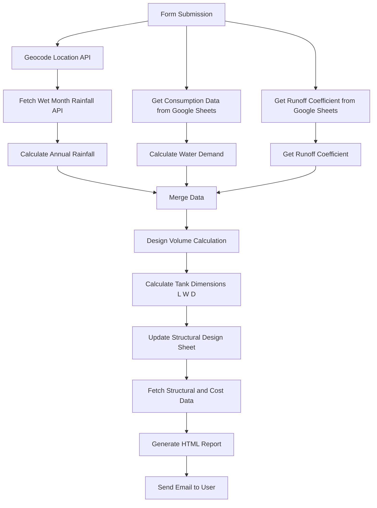

# 🌧 Rain Water Tank Estimation – n8n Mini Project

## 📌 Overview

This mini project is an automated **Rainwater Harvesting Underground Tank Design & Estimation System** built using **n8n workflow automation**.

It collects user inputs, processes rainfall and water demand data, calculates tank dimensions, performs structural checks, estimates cost, and sends an automated design report via email.

---

## 🎯 Objectives of the Project

- Automate civil engineering design calculations
- Reduce manual errors
- Integrate real rainfall data dynamically
- Generate instant technical reports
- Demonstrate workflow automation in engineering applications

---

## 🔄 Workflow Diagram

---

## 🛠 Technologies Used

| Technology | Category |
|------------|----------|
| n8n | Workflow Automation |
| Open-Meteo API | API Integration |
| Google Sheets API | Design & Consumption Datas |
| JavaScript (Code Nodes) | Programming Logic |
| Gmail API | Email Automation |
| HTML & CSS | Report Generation |
| n8n Form Trigger | Webhook Trigger |

---

## ✨ Project Highlights

- **Location-Based Design** — Uses real-time rainfall data for accurate estimation.  
- **Automated Volume Optimization** — Selects the most practical storage capacity.  
- **Intelligent Tank Sizing** — Calculates length, width, and depth using engineering constraints.  
- **Integrated Structural Checks** — Includes reinforcement and safety validations.  
- **Automated Cost Breakdown** — Generates detailed construction cost estimation.  
- **Instant Report Delivery** — Sends a formatted technical report via email automatically.
  
---

## 🖥 Deployment

This workflow is implemented using a **self-hosted n8n instance**.

- Runs locally / on private server
- Not publicly deployed as a web application
- Designed for academic demonstration and automation testing
  
---

## 🔚 Conclusion

> Engineering design meets workflow automation.

