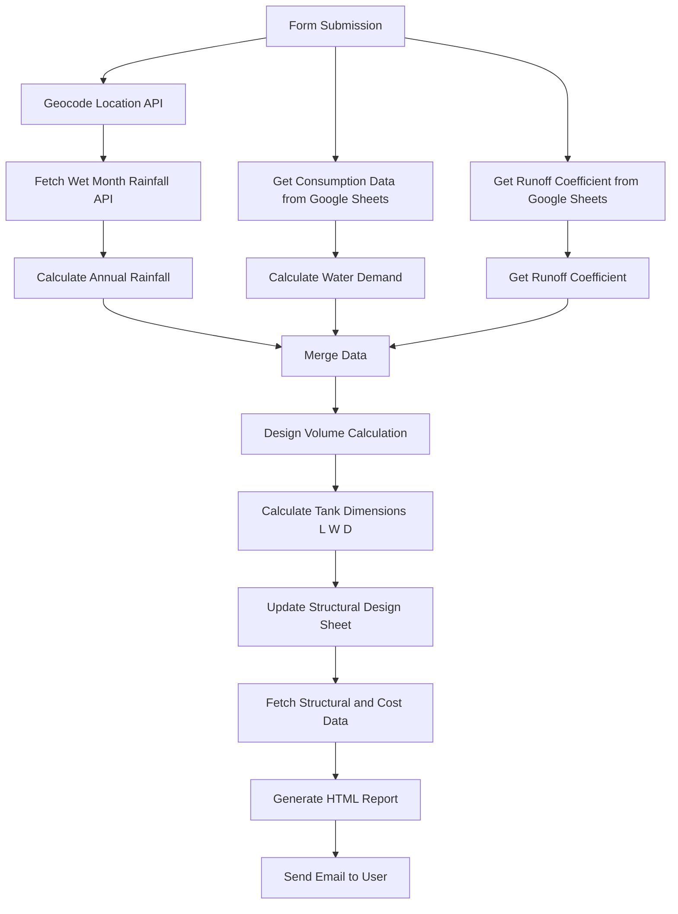

# 🌧 Rain Water Tank Estimation – n8n Mini Project

## 📌 Overview

This mini project is an automated **Rainwater Harvesting Underground Tank Design & Estimation System** built using **n8n workflow automation**.

It collects user inputs, processes rainfall and water demand data, calculates tank dimensions, performs structural checks, estimates cost, and sends an automated design report via email.

---
## 🔄 Workflow Diagram

## 🛠 Technologies Used

| Technology | Category |
|------------|----------|
| n8n | Workflow Automation |
| Open-Meteo API | API Integration |
| Google Sheets API | for Design & Consumption Datas |
| JavaScript (Code Nodes) | Programming Logic |
| Gmail API | Email Automation |
| HTML & CSS | Report Generation |
| n8n Form Trigger | Webhook Trigger |
